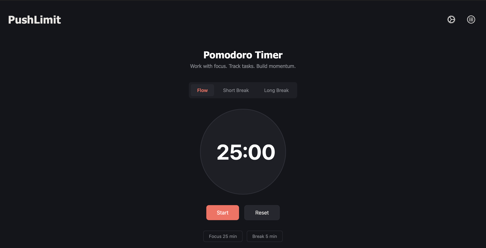

# 🍅 Pomodoro Timer

A clean and responsive Pomodoro Timer built with HTML, CSS, and JavaScript to help users stay focused, manage their time effectively, and build productive habits using the Pomodoro Technique.

---

## 🚀 Live Demo

https://hoishola.github.io/Pomodoro-Timer/

---

## 📸 Preview



---

## ✨ Features

- ⏱️ Customizable Pomodoro timer
- ▶️ Start, pause, and reset controls
- 📖 Learn about the Pomodoro Technique
- ❓ Interactive FAQ section
- 💡 Productivity tips
- 📬 Feedback section with email support
- 📱 Fully responsive design

---

## 🛠️ Built With

- HTML5
- CSS3
- JavaScript

---

## 📂 Project Structure

```text
pomodoro-timer/
│
├── index.html
├── style.css
├── script.js
├── README.md
└── images/
    └── preview.png
```

---

## 🚀 Future Improvements

- 🌙 Dark Mode
- ✅ Task Manager
- 📊 Daily Statistics
- 💾 Local Storage
- 🔔 Sound Notifications
- 🎨 Custom Themes

---

## 👨‍💻 Author

Made with ❤️ by Habeeb Ishola

GitHub: https://github.com/hoishola

---

## 📄 License

This project is open source and available under the MIT License.